

  
Claude Code + Obsidian 시리즈

  <ol>
    <li><a href="../claude-obsidian-setup/">Claude Code + Obsidian 셋업 가이드</a></li>
    <li><strong>Claude Code + Obsidian으로 정처기 공부</strong></li>
    <li class="upcoming">Claude Code + Obsidian 토큰 폭주 사건</li>
  </ol>

## 0. 들어가며

[1편 Claude Code + Obsidian 셋업 가이드](../claude-obsidian-setup/)에서 만든 구조를 정처기 실기 시험 공부에 적용해본 사례다.

학습 볼트를 어떻게 짰고, 모드별로 규칙을 어떻게 나눠 운영했는지, 그 결과 노트가 어떻게 쌓이고 외우는 단계와 시험 직전 요약본까지 어떻게 이어졌는지를 다룬다. 마지막에는 같은 방식을 다른 시험·학습 주제에도 그대로 옮길 수 있도록 정리한 [**템플릿**](#8-템플릿-공유)도 함께 공유한다.

## 1. 자격증에 적용

Claude Code와 Obsidian 세팅을 마칠 무렵 자격증 시험이 다가오고 있었다. 이 구조를 활용하면 나만의 정처기 지식 노트를 만들 수 있지 않을까 싶어 적용해보기로 했다.

사실 평소에도 LLM을 학습용으로 자주 활용해왔다. 수업이나 개념 정리 도중 헷갈리거나 이해가 안 되는 부분을 질문하고, 세션 마무리에 그 내용을 학습 노트 형식으로 받아 노션에 기록해두곤 했다. 이 세팅에서도 같은 식으로 공부하고 그 결과를 노트로 옮기는 흐름이 잘 어울릴 것 같았다.

처음 떠올린 구조는 단순했다. 기출 문제를 풀고 나서 Claude와 질의응답을 주고받으며 틀린 문제 위주로 공부한다. 그러면 그 회차에서 나온 개념들을 Claude가 개념노트에 정리해둔다. 이때 내가 틀렸거나 헷갈렸던 것, 질문했던 것은 더 자세히 풀어 적도록 미리 일러둔다. 이렇게 모든 기출을 다 풀고 나면 나에게 딱 맞는 정처기 대비 노트가 생긴다.

이 아이디어로 Claude와 계속 대화하며 골격을 잡았고 실제로 사용하면서 살을 붙였다. 약 2주에 걸쳐 완성된 결과물을 이 글에서 풀어본다.

## 2. 가능했던 활용

내가 세팅한 정처기 볼트에서 Claude를 이렇게 활용했다. 기출 문제를 토대로 개념노트를 채우고, 틀린 문제를 다시 풀고, 헷갈리는 개념을 퀴즈로 반복했다. 각 단계를 가볍게 도식화하면 다음과 같다.

**① 기출복기** — 기출을 풀고 모르는 문제는 질문하며 개념노트를 채우는 과정.

<figure class="diagram-light">

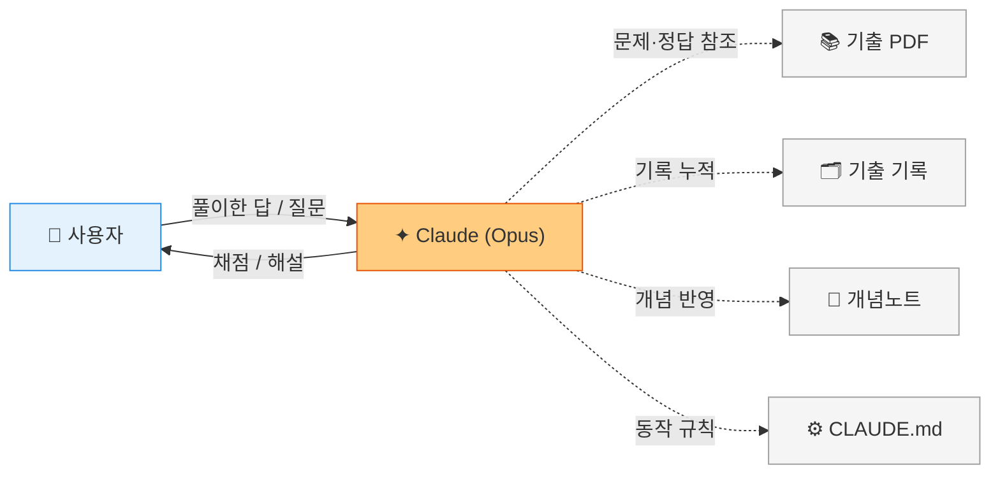
```mermaid
%%{init: {'theme':'default'}}%%
flowchart LR
    classDef user fill:#E3F2FD,stroke:#1E88E5
    classDef opus fill:#FFCC80,stroke:#E65100
    classDef data fill:#F5F5F5,stroke:#9E9E9E

    U["👤 사용자"]:::user
    C["✦ Claude (Opus)"]:::opus
    D1["📚 기출 PDF"]:::data
    D2["📝 개념노트"]:::data
    D3["🗂️ 기출 기록"]:::data
    R["⚙️ CLAUDE.md"]:::data

    U -->|"풀이한 답 / 질문"| C
    C -->|"채점 / 해설"| U

    C -. "문제·정답 참조" .-> D1
    C -. "기록 누적" .-> D3
    C -. "개념 반영" .-> D2
    C -. "동작 규칙" .-> R
```

</figure>

**② 오답문풀** — 틀렸던 문제를 다시 푼다. 단, 무작위로. 또 틀리면 헷갈림 표시를 추가.

<figure class="diagram-light">

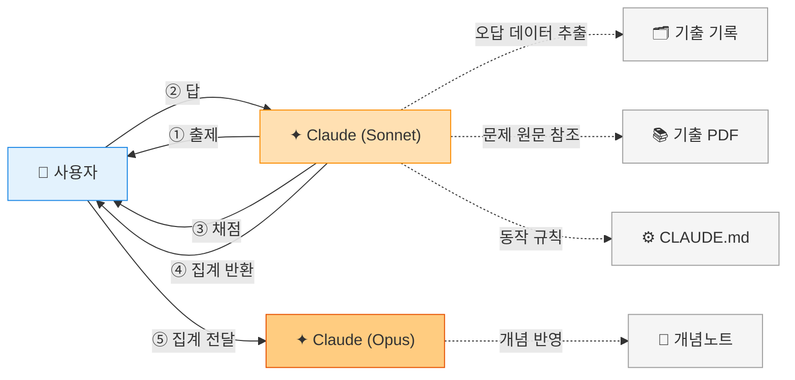
```mermaid
%%{init: {'theme':'default'}}%%
flowchart LR
    classDef user fill:#E3F2FD,stroke:#1E88E5
    classDef opus fill:#FFCC80,stroke:#E65100
    classDef sonnet fill:#FFE0B2,stroke:#FB8C00
    classDef data fill:#F5F5F5,stroke:#9E9E9E

    U["👤 사용자"]:::user
    S["✦ Claude (Sonnet)"]:::sonnet
    O["✦ Claude (Opus)"]:::opus
    D1["🗂️ 기출 기록"]:::data
    D2["📚 기출 PDF"]:::data
    D3["📝 개념노트"]:::data
    R["⚙️ CLAUDE.md"]:::data

    S -->|"① 출제"| U
    U -->|"② 답"| S
    S -->|"③ 채점"| U
    S -->|"④ 집계 반환"| U
    U -->|"⑤ 집계 전달"| O

    S -. "오답 데이터 추출" .-> D1
    S -. "문제 원문 참조" .-> D2
    S -. "동작 규칙" .-> R
    O -. "개념 반영" .-> D3
```

</figure>

**③ 랜덤퀴즈** — 헷갈리는 개념을 퀴즈로 풀면서 바로바로 답을 확인. 암기에 큰 도움이 되었다.

<figure class="diagram-light">

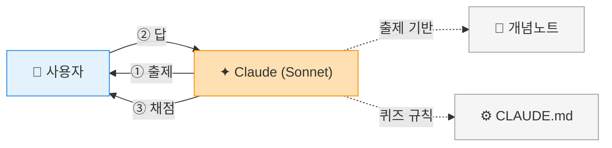
```mermaid
%%{init: {'theme':'default'}}%%
flowchart LR
    classDef user fill:#E3F2FD,stroke:#1E88E5
    classDef sonnet fill:#FFE0B2,stroke:#FB8C00
    classDef data fill:#F5F5F5,stroke:#9E9E9E

    U["👤 사용자"]:::user
    S["✦ Claude (Sonnet)"]:::sonnet
    D["📝 개념노트"]:::data
    R["⚙️ CLAUDE.md"]:::data

    S -->|"① 출제"| U
    U -->|"② 답"| S
    S -->|"③ 채점"| U

    S -. "출제 기반" .-> D
    S -. "퀴즈 규칙" .-> R
```

</figure>

## 3. 볼트 구조

최종적으로 완성된 볼트 구조는 다음과 같다.

<figure style="margin: 1.5rem 0;">
<pre style="background: rgba(127,127,127,0.06); border: 1px solid rgba(127,127,127,0.2); border-radius: 8px; padding: 1.1rem 1.4rem; font-family: ui-monospace, SFMono-Regular, 'JetBrains Mono', Menlo, monospace; font-size: 0.92em; line-height: 1.75; overflow-x: auto; margin: 0;">
정처기/                       ← Obsidian 볼트
├── CLAUDE.md                ← 볼트 전용 규칙. 모드별 규칙 파일 로드 시점 명시
├── 개념노트/                ← 과목별 단일 파일 (대분류 7 + 프로그래밍 3)
│   ├── 운영체제.md
│   ├── 데이터베이스.md
│   └── ...
├── 기출복기/                ← 회차별 복기 기록 (2020-1 ~ 2025-3)
│   ├── 2020-1회.md
│   ├── 2020-2회.md
│   └── ...
├── 규칙/                    ← 모드별 규칙 파일
│   ├── 개념노트.md           ← 개념노트 작성·정제 규칙
│   ├── 기출복기.md           ← 회차 종료 시 정리 절차
│   ├── 오답문풀.md           ← 오답 재풀이 규칙
│   └── 목차.md              ← 시험 표준 목차 (개념 배치 기준)
├── 자료/                    ← 참고 외부 자료
└── 요약본.md                ← 시험 직전에 생성한 압축 노트
</pre>
</figure>

## 4. CLAUDE.md와 규칙.md

CLAUDE.md의 구조는 다음과 같다.

- **목적** — 정처기 실기 시험 대비 학습 공간임을 밝히고 Obsidian 볼트로 관리할 것을 명시
- **기출 PDF 위치** — 회차마다 참조할 기출 PDF의 외부 경로를 미리 명시
- **폴더 구조** — Claude가 매번 디렉터리를 훑지 않아도 볼트 구조를 알 수 있게 미리 적어둠
- **대화 흐름** — 사용자와 Claude 간 대화 진행 방식을 미리 규정
- **규칙 파일 로드 시점** — 어떤 작업 트리거에서 어떤 규칙 파일을 참조할지 명시 (이 글의 핵심)
- **파일 작업** — 안전을 위해 파일 생성·수정·삭제 전 사용자에게 확인을 받도록 함
- **랜덤퀴즈** — 나중에 추가된 모드. 짧아서 별도 파일 없이 여기 직접 정의
- **응답 스타일** — 한국어 응답·핵심 키워드 굵게·코드 문제 단계별 트레이싱 등 출력 형식 정의

핵심은 모든 규칙을 CLAUDE.md 한 파일에 담지 않는다는 것이다. 세부 규칙은 별도 파일로 나누고 CLAUDE.md는 그 위치와 로드 시점만 안내한다. Claude는 매 대화마다 CLAUDE.md를 컨텍스트에 올려두고 시작하기 때문에 그만큼 토큰을 소비하게 된다. 모든 규칙이 한 파일이었다면 매 대화마다 542줄(≈22 KB)짜리 문서를 읽었겠지만, 분리했기 때문에 그보다 1/8 수준인 65줄(≈4 KB)만 읽으면 된다.

비용을 줄이는 또 다른 축으로 모델도 분리해두었다. 메인 학습·복기·개념정리는 Opus로 진행하되, 단순 출제·채점만 하는 모드는 굳이 Opus를 쓸 이유가 없어 Sonnet으로 돌린다.

### 4-1. 목차

목차.md는 시중 자료의 정처기 표준 목차를 미리 정리해둔 파일이다.

<figure style="margin: 1.5rem 0;">
  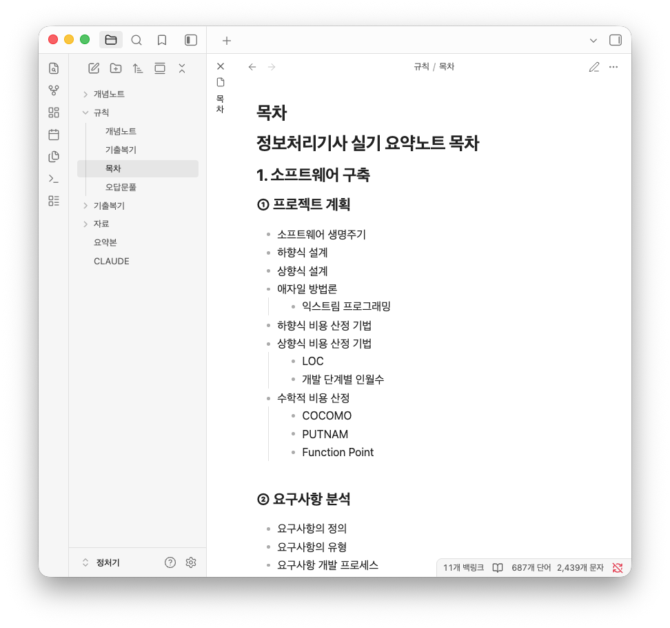
</figure>

개념노트에서 내용을 정리할 때 이 목차를 참고하여 작성 위치를 잡는다. 마치 길잡이 역할이라고 할 수 있다.

### 4-2. 기출복기

1회분의 기출을 풀고 나서 Claude와 대화하며 정리할 때 따르는 규칙이다.

- **저장 위치** — 회차별 파일을 어디에 어떤 이름으로 저장할지 명시
- **저장 내용** — 문제별 정오답·해설·관련 개념 링크를 기록
- **종료 시 정리** — 마지막 문항까지 끝난 뒤 메인 세션이 직접 회차 파일과 개념노트를 정리 (에이전트 위임 X)
- **개념노트 갱신 규칙** — 별도 파일로 위임 (4-3에서 자세히)
- **완료 보고** — 어떤 파일들이 갱신됐는지 간략히 알림

처음에는 따로 채점을 한 뒤 틀린 것만 질문하는 식으로 했지만 생각해보니 채점도 한 번에 진행해도 되겠다 싶었다. 그래서 나중에는 1번부터 내 답을 차례대로 주고 틀리면 그 자리에서 질문하는 식으로 진행했다.

대화 시작 시 'OO년도 O회차'라고 명시하면 Claude가 해당 문제 PDF를 읽고 대기한다. 나는 답을 차례대로 넘기는데 한 문제씩이라기보다 여러 개를 엔터로 구분해 한 번에 던져도 알아서 잘 알아듣는다. Claude는 질문에 답해주면서 채점 결과를 계속 기록하다가 회차가 끝나면 규칙에 정의된 형식대로 정리한다.

> 중간에 채점이 오래 걸려서 보니 PDF가 길다고 답지까지 읽지 않고 Claude가 직접 채점하고 있던 적이 있었다. 그래서 그 다음부터는 답지까지 모두 읽어오도록 규칙에 추가했다. (왜 멀쩡히 있는 답을 두고 직접 채점하면서 내 토큰을 낭비하냐!)

### 4-3. 개념노트

기출복기 종료 시 개념을 옮겨 적을 때 따르는 규칙이다.

- **파일 구성** — 개념노트의 저장 경로와 어떤 파일들이 있는지 명시
- **섹션 배치 규칙** — 같은 개념은 기존 섹션에 누적하고 새 섹션은 정해진 기준에 따라서만 신설
- **링크 연결 레벨 규칙** — 기출과 개념을 잇는 위키링크의 연결 깊이 기준
- **작성 규칙** — 헤딩 간결화·보조 섹션 금지·중복 통합·코드 해설 분량 제어 등 노트 형식 세부 규칙

개념노트를 보면서 내가 원하는 바를 Claude에게 얘기하며 정해 나갔다. 처음부터 완벽하지는 않았지만 노트가 완성되어 가면서 내 선호도 함께 쌓여 규칙 파일 중 분량이 가장 커졌다. 그 가운데 가장 중점을 둔 것은 기존 내용을 보강하도록 만드는 부분이었다.

여러 회차를 풀고 개념이 쌓이는 동안 노트가 과하게 길어지고 있었다. Claude가 기존 내용을 보강하기보다 새로 추가하는 쪽으로 작업하는 듯해 확인해보니, 같은 개념을 출제마다 변형된 이름으로 새 섹션에 적고 있었다. 그래서 대·중분류를 기본으로 두되 출제 빈도가 높거나 밀도가 큰 경우에만 소분류까지 허용하도록 정해두었다.

그 외에도 헤딩 옆에 회차·문제번호를 써넣거나 '답안 작성 팁' 같은 보조 섹션을 만들거나 코드 해설이 과하게 길어지는 등 자잘한 부분도 내 입맛에 맞게 규칙으로 정해 나갔다.

### 4-4. 오답문풀

특정 연도의 오답·헷갈림 문제만 무작위로 다시 풀 때 따르는 규칙이다.

- **모델** — Sonnet으로 고정
- **출제 범위** — 해당 연도 기출복기에서 오답·헷갈림 문제만 추려 무작위 순서로 출제
- **출제 방식** — PDF 원본 그대로 복원. 지문·코드는 변형하거나 의역하지 않음
- **출처 비공개** — 어느 회차 몇 번인지 알려주지 않음
- **채점 피드백** — 정답이면 짧게, 오답이면 어디가 틀렸는지 짚어주고 혼동 짝 개념 비교
- **종료 시 집계** — 재오답을 카테고리별로 묶어 알려줌. 노트 갱신은 별도 세션에서 진행

꽤나 도움이 되었던 기능이다. 트리거를 지정해두었기 때문에 "22년도 오답문풀 하자"라고 하면 22년도 기출 중 오답을 무작위로 섞어 출제해준다. 채점이 끝나면 틀린 문제를 집계해 반환해주고 반환된 결과는 Opus 세션에서 개념노트에 업데이트했다. (Pro 플랜이었다면 Sonnet으로 다 해결했을 것 같다.) 또 틀린 문제는 헷갈림 표시를 추가하도록 했다.

### 4-5. 랜덤퀴즈

암기해야 하는 개념들을 퀴즈로 반복 학습할 때 따르는 규칙이다.

- **모델** — Sonnet 권장 (Opus면 모델 변경 확인)
- **출제 범위** — 특정 파일·주제·전체 등 사용자 요청에 따름
- **형식** — 단답형·빈칸뚫기 위주. 코드 트레이싱은 출제하지 않음
- **출제 방식** — 10문제를 미리 생성해 1문제씩 출제. 소진되면 다음 10문제 생성
- **진행** — 출제 → 응답 → 정답이면 짧게, 오답이면 간단 해설 후 다음 문제
- **출제 소스** — 개념노트 본문 기반

정처기처럼 자잘하게 외울 게 많을 때 좋은 방법이었다. 그냥 대화창 켜놓고 계속했다. 사실 오답을 다시 푸는 것보다 퀴즈가 제일 도움이 되었다.

## 5. 노트 둘러보기

실제 완성된 내 옵시디언의 모습은 다음과 같다. 각 성격별로 볼 수 있도록 탭 형태로 구현하였다.

### 5-1. 기출파일

  

    <button class="tab-btn active" data-tab="recall-page">기출파일</button>
    <button class="tab-btn" data-tab="hover-preview">연결 문서 바로확인</button>
    <button class="tab-btn" data-tab="recall-with-graph">로컬 그래프 뷰</button>
  

  

    

      
회차별 풀이 기록이다. 20문제에 대해 정오답을 확인할 수 있고 관련 개념노트와 연결된다.

      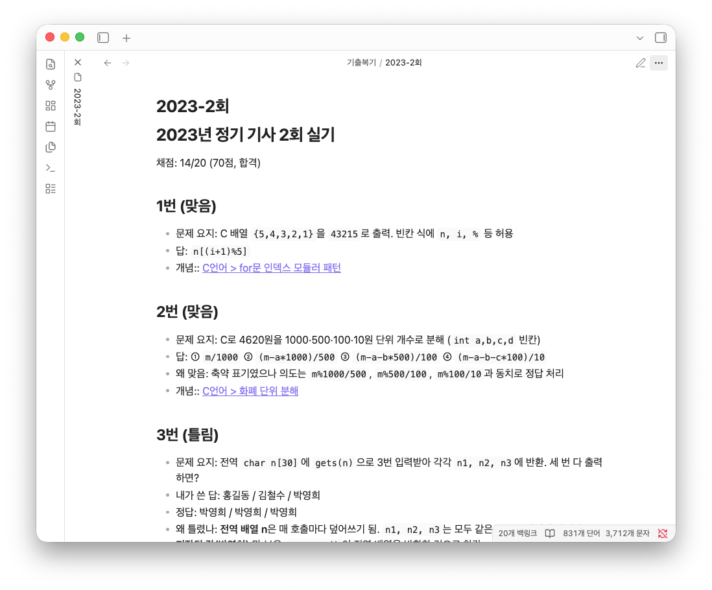
    

    

      
보라색 링크에 마우스를 올리면 연결된 개념노트를 바로 볼 수 있다.

      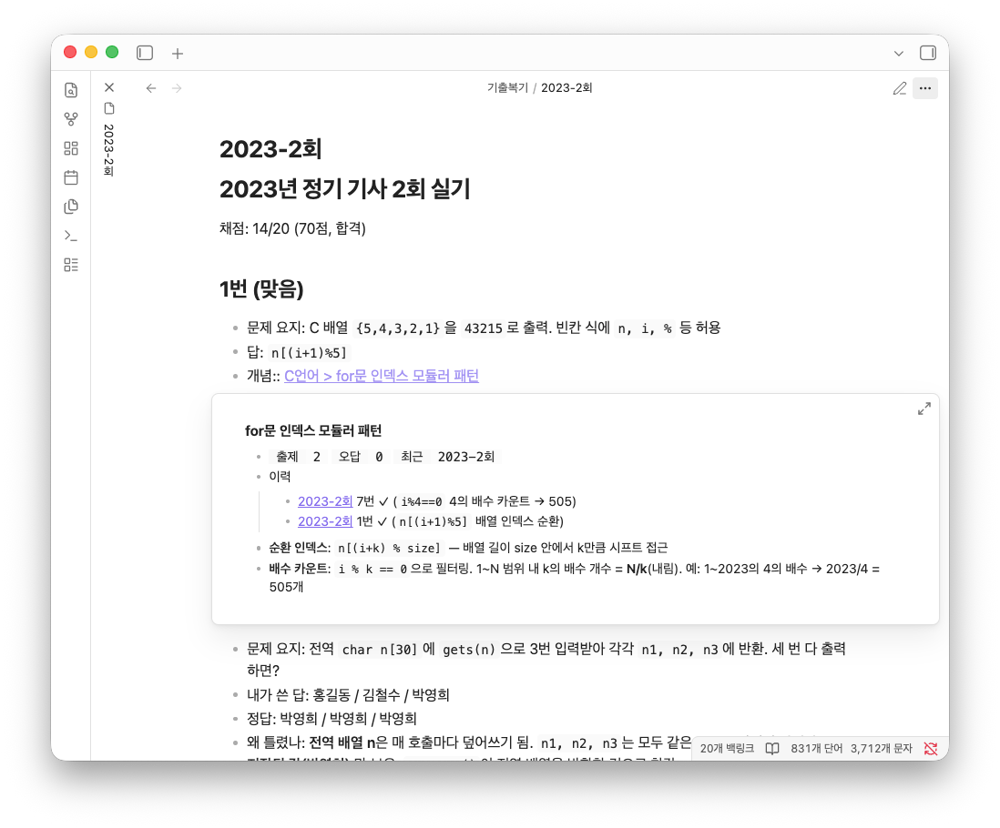
    

    

      
옵시디언이 제공하는 로컬 그래프 뷰. 이번 회차에 어떤 개념이 나왔는지 확인할 수 있다.

      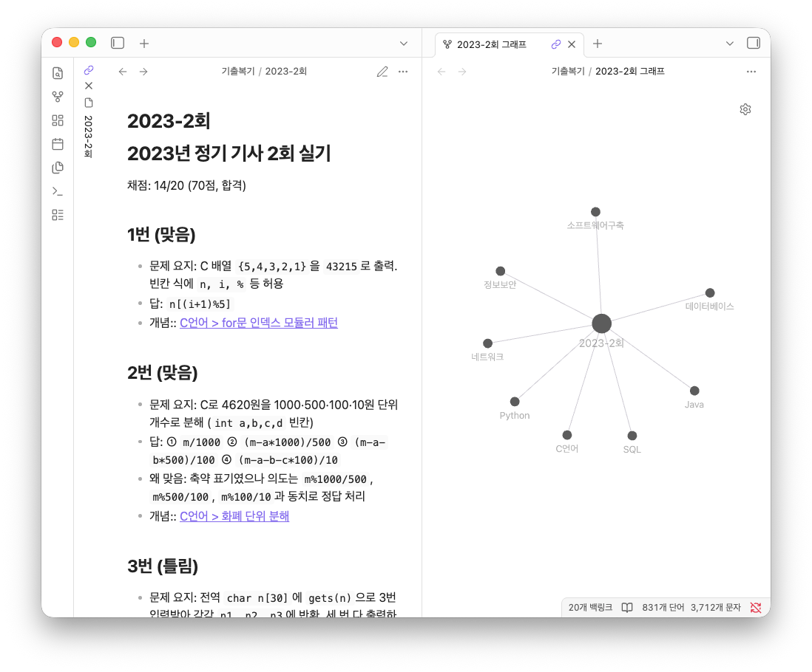
    

  

### 5-2. 개념노트

  

    <button class="tab-btn active" data-tab="concept-page">본문</button>
    <button class="tab-btn" data-tab="concept-raw">원본 마크다운</button>
    <button class="tab-btn" data-tab="concept-backlink">백링크</button>
  

  

    

      
실제 만들어진 개념노트. 메타블록으로 출제·오답·최근·이력을 알 수 있고 개념이 잘 정리되어 있다.

      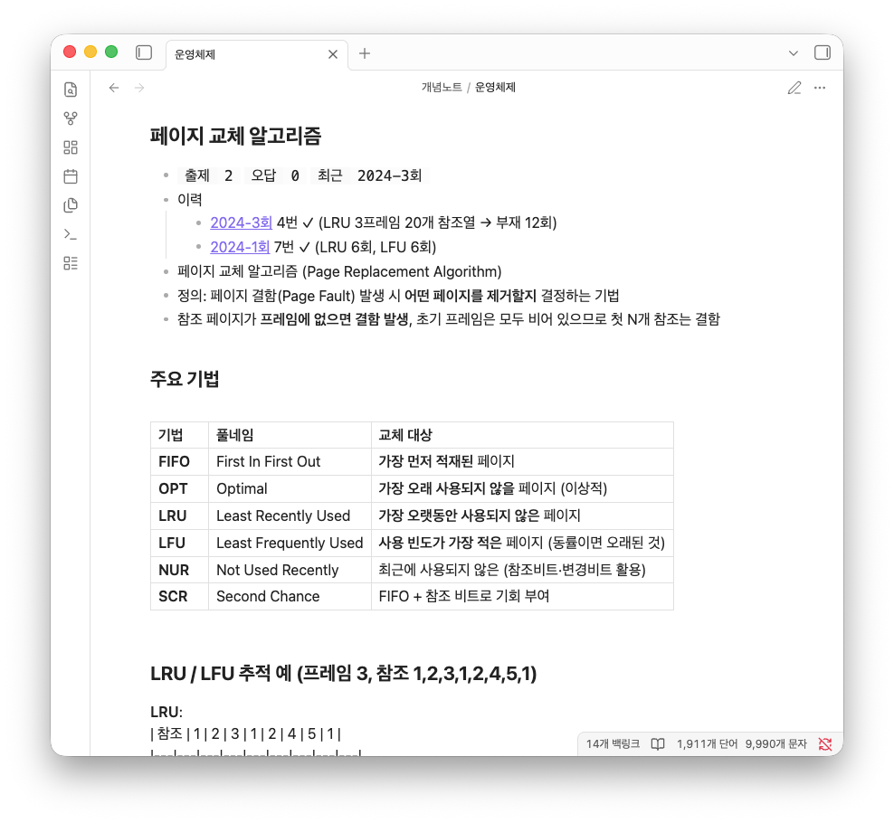
    

    

      
md 파일에 실제 쓰여진 원본. 이걸 직접 타이핑한다는 건 말이 안 된다.

      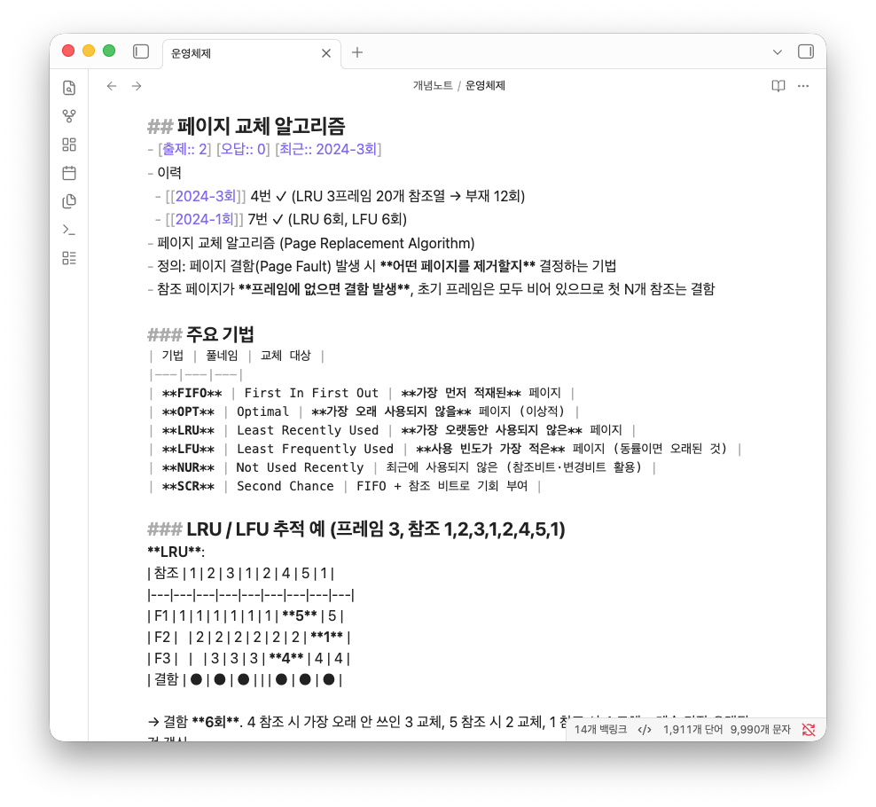
    

    

      
기출파일에서 위키링크를 걸어두었기 때문에 백링크 패널에서도 연결이 따라온다.

      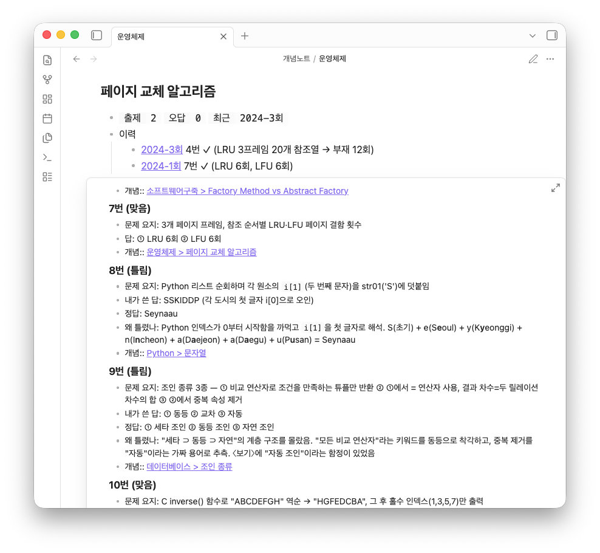
    

  

### 5-3. 그래프 뷰

  

    <button class="tab-btn active" data-tab="graph-all">전체</button>
    <button class="tab-btn" data-tab="graph-yearly">연도별 그래프 뷰</button>
  

  

    

      
19개 회차 + 10개 개념노트가 그물처럼 연결된 전체 그래프.

      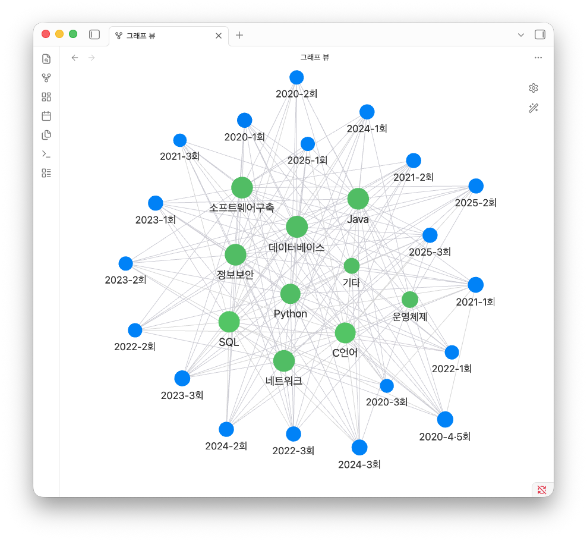
    

    

      
한 연도(2024년)에 필터를 걸어 빈출 주제를 살펴봤는데, 생각보다 균등하다.

      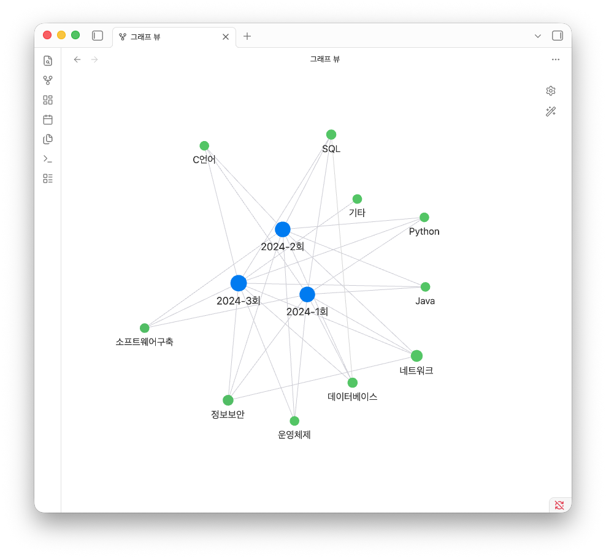
    

  

## 6. Claude와 공부하기

앞 섹션에서 구축한 개념노트를 기반으로 Claude와 랜덤퀴즈·오답문풀을 진행했다. 실제 터미널에서 두 모드로 대화한 예시 화면이다.

  

    <button class="tab-btn active" data-tab="quiz-cycle">랜덤퀴즈</button>
    <button class="tab-btn" data-tab="oab-cycle">오답문풀</button>
  

  

    

      
10문제를 미리 생성한 뒤 한 문제씩 출제한다. 답을 입력하면 짧은 채점 후 바로 다음 문제.

      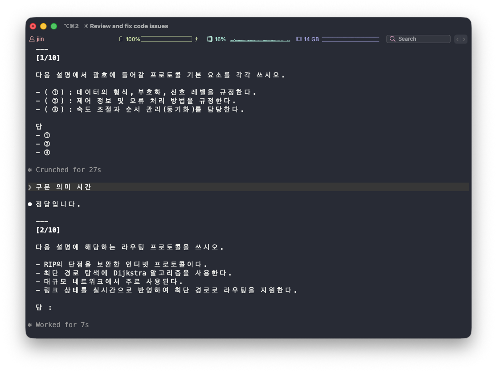
    

    

      
사용자가 지정한 범위에서 틀렸던 문제를 무작위로 다시 푼다.

      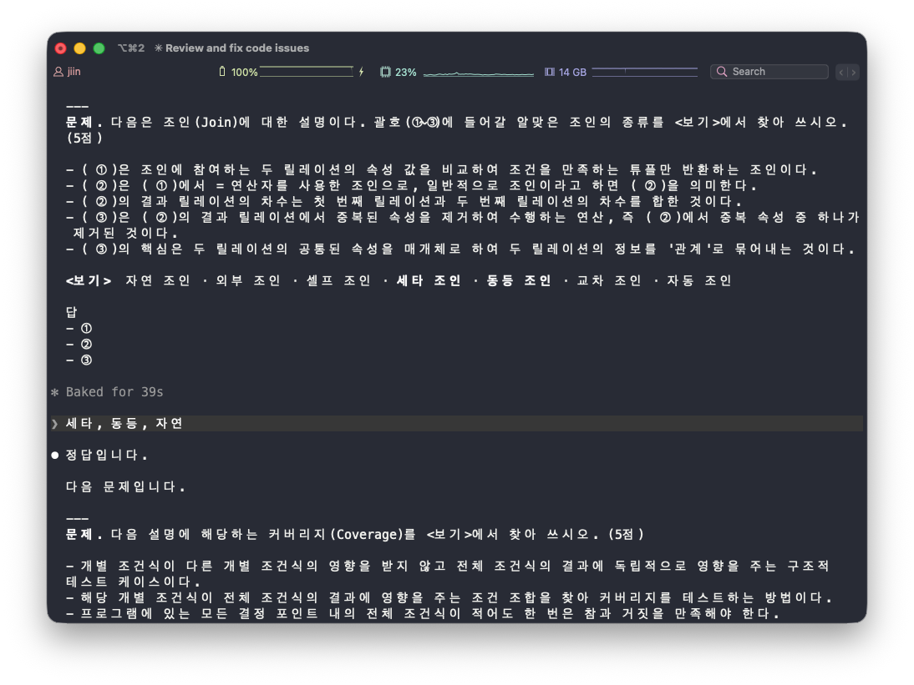
    

  

## 7. 요약본

시험 직전 모든 기출을 풀고 개념을 공부한 뒤, Claude에게 틀린 것과 헷갈린 것을 중심으로 압축한 요약본을 만들어달라 했다. 그동안 쌓아온 나만의 지식 베이스에서 핵심을 추출한 셈이라 의미가 있는 것 같다.

전체를 담기엔 분량이 커서 '네트워크' 과목 부분만 첨부하면 다음과 같다.

  

    

      
      
      
    

    요약본.md — 4. 네트워크
  

  

#### 4-1. OSI 7계층 (물데네전세표응, 하→상)

| 계층 | 역할 | 장비 | 프로토콜 |
|---|---|---|---|
| **1. 물리(Physical)** | 전기 신호 전송 | Hub·Repeater | RS-232·V.24 |
| **2. 데이터링크(Data-link)** | **프레임**·MAC 주소·오류 제어 | Bridge·Switch | HDLC·PPP·Ethernet |
| **3. 네트워크(Network)** | 경로 설정·IP 주소 | Router | **IP·ICMP·ARP·IGMP** |
| **4. 전송(Transport)** | 종단 간 신뢰성 | Gateway | **TCP·UDP** |
| **5. 세션(Session)** | 연결 설정·유지·종료 | | SSH·NetBIOS |
| **6. 표현(Presentation)** | 암호·압축·인코딩 | | JPEG·MPEG·SSL |
| **7. 응용(Application)** | 사용자 서비스 | | HTTP·FTP·SMTP·DNS·Telnet |

**TCP/IP 4계층**: 네트워크 액세스 · 인터넷 · 전송 · 응용

#### 4-2. 프로토콜 기초

**프로토콜 3요소 (구의시)**: 구문(Syntax)·의미(Semantics)·시간(Timing)
- 구문: 데이터 형식·부호화
- 의미: 제어 정보·에러 처리
- 시간: 송수신 속도·순서

**TCP (Transmission Control Protocol)**
- 연결지향·신뢰성·흐름제어·혼잡제어
- **3-way handshake**: SYN → SYN+ACK → ACK
- **4-way handshake** (종료): FIN → ACK → FIN → ACK

**UDP (User Datagram Protocol)**
- 비연결·비신뢰·빠름·브로드캐스트
- DNS·스트리밍·VoIP·DHCP

#### 4-3. 네트워크 계층 보조 프로토콜

| 프로토콜 | 역할 |
|---|---|
| **ICMP** | 오류·제어 메시지. ping·traceroute (24-3 5번 Smurf와 연관) |
| **ARP** | IP → MAC 변환 |
| **RARP** | MAC → IP 변환 |
| **IGMP** | 멀티캐스트 그룹 관리 |
| **DHCP** | IP 자동 할당 |

#### 4-4. 라우팅 프로토콜 (24-1 2번, 24-2 20번)

**내부 게이트웨이(IGP)**: AS 내부
- **RIP (Routing Information Protocol)**: **거리벡터·홉 카운트** 기반. 최대 15홉. 소규모. **가중치 무시**
- **OSPF (Open Shortest Path First)**: **링크상태·Dijkstra**. 대규모. 실시간 반영. 가중치 고려

**외부 게이트웨이(EGP)**: AS 간
- **BGP (Border Gateway Protocol)**: 경로 벡터. 인터넷 백본

**주의**: 문제에 가중치가 있어도 **RIP이면 홉 수로만** 판단 (24-2 20번 함정)

#### 4-5. IP 주소·서브네팅

**IPv4**: 32비트 (4×8). 점 십진. A/B/C/D(멀티캐스트)/E 클래스
**IPv6**: **128비트** (8×16). 콜론 16진. 주소 고갈 해결.
- 특징: 헤더 단순화, 자동 구성, **보안(IPSec 내장)**, QoS 지원

**CIDR (Classless Inter-Domain Routing)**: 클래스리스. `/24`로 서브넷 표기
- `192.168.1.0/24` = 서브넷 마스크 `255.255.255.0`

**서브네팅 계산**
- 호스트 수 = 2^(호스트비트) - 2 (네트워크·브로드캐스트 제외)
- 예: `/26` = 호스트 비트 6 → 2^6 - 2 = 62 호스트

**NAT (Network Address Translation)**: 사설-공인 IP 변환. IP 고갈 대응

#### 4-6. 패킷 교환·오류 제어

**패킷 교환 방식** (24-2 14번)
- **가상회선(Virtual Circuit)**: 연결형. 경로 **미리 고정**. 순서 보장 (예: X.25)
- **데이터그램(Datagram)**: 비연결형. 헤더에 목적지. 경로 **개별 결정** (예: IP)

**오류 제어**
- **FEC (Forward Error Correction)**: 전진 오류 수정. 해밍·상승 코드
- **BEC (Backward Error Correction)**: 후진 오류 수정. ARQ 방식
  - Stop-and-Wait: 전송 후 ACK 대기
  - Go-Back-N: 오류 발생 이후 모두 재전송
  - Selective-Repeat: 오류 프레임만 재전송

**오류 검출**: 패리티·CRC(순환중복검사)·체크섬·해밍 코드

#### 4-7. 기타 네트워크

- **HDLC (High-level Data Link Control)**: 점대점·다지점 데이터링크. 구조: 플래그+주소+제어+정보+FCS+플래그
- **VLAN**: 논리적 네트워크 분할
- **애드혹(Ad-hoc) Network** (24-3 20번): 고정 인프라 없이 **모바일 호스트만으로** 구성. 멀티홉·자기구성. 재난·군사
- **VPN (Virtual Private Network)** (24-3 7번): 공중망 + 암호화로 전용 회선처럼. IPSec/SSL VPN
- **SDN (Software Defined Network)**: 제어·데이터 평면 분리
- **NFV (Network Function Virtualization)**: 네트워크 기능 가상화
- **Mesh Network**: 그물형. 노드 간 다경로

  

## 8. 템플릿 공유

내가 활용했던 방식을 다른 시험 준비나 개념 학습 등에도 손쉽게 사용할 수 있도록 템플릿을 정리해보았다. 꼭 필요한 규칙은 미리 설정해두었고, 학습 주제 설정과 Claude Code + Obsidian 셋업 과정은 README에 TODO로 남겨두어 손쉽게 따라 할 수 있게 했다. Claude Code와 공유하는 지식 베이스라는 의미에 중점을 두었다.

내가 만든 구조도 참고할 수 있도록 했다. 위에서 언급한 내용들이 실제 파일에 대략 어떻게 적혀 있는지 알 수 있다.

  

    <button class="tab-btn active" data-tab="form">양식</button>
    <button class="tab-btn" data-tab="example">예시</button>
  

  

    

      

        

          vault-base/
          <a class="file-browser-action" href="vault-base.zip" download>zip 다운로드</a>
        

        

          

            <ul>
              <li class="tree-item file active" data-file="template-claude.txt" data-name="CLAUDE.md">CLAUDE.md</li>
              <li class="tree-item file" data-file="template-readme.txt" data-name="README.md">README.md</li>
            </ul>
          

          

            

              CLAUDE.md
              <button class="viewer-copy">복사</button>
            

            <pre class="viewer-content">로딩 중…</pre>
          

        

        

          다운로드 후 자기 학습 볼트 위치로 옮기고, 그 폴더에서 Claude Code(또는 Codex CLI)를 실행해 "README의 체크리스트를 따라 내 학습 볼트를 빌드해줘"라고 요청하면 된다.
        

      

    

    

      

        

          정처기/
        

        

          

            <ul>
              <li class="tree-item file active" data-file="example-claude.txt" data-name="CLAUDE.md">CLAUDE.md</li>
              <li class="tree-item folder">규칙</li>
              <li class="tree-item file indent" data-file="example-concept.txt" data-name="규칙/개념노트.md">개념노트.md</li>
              <li class="tree-item file indent" data-file="example-recall.txt" data-name="규칙/기출복기.md">기출복기.md</li>
              <li class="tree-item file indent" data-file="example-oab.txt" data-name="규칙/오답문풀.md">오답문풀.md</li>
              <li class="tree-item file indent" data-file="example-toc.txt" data-name="규칙/목차.md">목차.md</li>
            </ul>
          

          

            

              CLAUDE.md
              <button class="viewer-copy">복사</button>
            

            <pre class="viewer-content">로딩 중…</pre>
          

        

        

          핵심 부분만 발췌. 전체 운영 사례는 위 2~7번 본문과 1편 시리즈에서 다룬다.
        

      

    

  

## 9. 그래서 정처기 실기는...

생각보다 시험에 프로그래밍이 많이 나왔다. 최대한 공부한다고 했는데 제일 헷갈리는 Python 문법이 주로 나온 것 같다. 개념은 최대한 맞춘 것 같은데 오히려 프로그래밍에서 실수를 많이 한 것 같아 아쉽다. 지금은 부분점수 받아야 겨우 커트라인을 넘길 것 같은데... 결과는 6월 중순에 나온다. ㅎㅎ 아무튼 Claude를 활용해봤다는 것에 의의를 두려고 한다.

## 10. 마무리하며

뭔가 내용을 자세히 담다 보니 10번까지 와버렸다. 이번 글은 여기서 마무리하고, 다음 글에서 엄청나게 토큰을 허비했던 사건을 다루며 이 시리즈를 끝내고자 한다.

  
Claude Code + Obsidian 시리즈

  <ol>
    <li><a href="../claude-obsidian-setup/">Claude Code + Obsidian 셋업 가이드</a></li>
    <li><strong>Claude Code + Obsidian으로 정처기 공부</strong></li>
    <li class="upcoming">Claude Code + Obsidian 토큰 폭주 사건</li>
  </ol>

