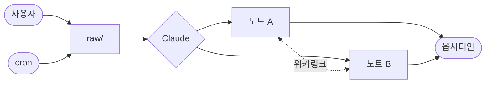

<details class="series-callout" open>
  <summary class="series-label">Claude Code + Obsidian 시리즈</summary>
  <ol>
    <li><strong>Claude Code + Obsidian 셋업 가이드</strong></li>
    <li class="upcoming">Claude Code + Obsidian으로 정처기 공부</li>
    <li class="upcoming">Claude Code + Obsidian 토큰 폭주 사건</li>
  </ol>
</details>

## 0. 들어가며

4월에 Claude Pro 계정의 토큰 부족을 견디지 못하고 Max로 갈아탔는데, 막상 결제하고 나니 토큰이 남아돌게 됐다. 어디에 쓸까 고민하던 차에 Claude Code와 옵시디언을 연계해 지식 노트를 만드는 영상들이 유튜브 알고리즘에 떴고, 과거 링크 연결이 복잡해 포기했던 옵시디언을 다시 도전해보기로 했다. (겸사겸사 남는 토큰도 활용할 겸.)

Claude Code와 옵시디언을 세팅하면 다음의 것들이 가능하다.

- 옵시디언 셋업·관리는 Claude Code가 전담, 사용자는 내용 작성만
- 위키링크·메타블록 관리, 유실 링크 점검·복구
- 주제별 `CLAUDE.md`로 도메인마다 다르게 행동하는 Claude Code

## 1. 폴더 구조

<figure style="margin: 1.5rem 0;">
<pre style="background: rgba(127,127,127,0.06); border: 1px solid rgba(127,127,127,0.2); border-radius: 8px; padding: 1.1rem 1.4rem; font-family: ui-monospace, SFMono-Regular, 'JetBrains Mono', Menlo, monospace; font-size: 0.92em; line-height: 1.75; overflow-x: auto; margin: 0;">
상위 폴더/                <span style="opacity:0.65;">← 여러 볼트를 묶어두는 부모 폴더 (옵시디언은 이걸 모름)</span>
├── CLAUDE.md            <span style="opacity:0.65;">← 모든 볼트에 공통 적용</span>
├── 주제 A (볼트)/       <span style="opacity:0.65;">← 옵시디언이 여는 단위 = 볼트 한 개</span>
│   ├── CLAUDE.md        <span style="opacity:0.65;">← 이 볼트 전용 규칙</span>
│   ├── raw/             <span style="opacity:0.65;">← 미가공 자료 (스크랩·PDF·메모 등)</span>
│   └── 노트/            <span style="opacity:0.65;">← Claude가 raw를 가공해 만든 정리 노트 (위키링크로 서로 참조)</span>
└── 주제 B (볼트)/       <span style="opacity:0.65;">← 주제마다 내부 구조는 자유</span>
</pre>
</figure>

옵시디언은 볼트라는 보관함으로 내부 노트들을 마크다운 파일로 관리한다. 이 볼트들을 저장할 상위 폴더를 지정하고, Claude Code의 시작이자 전부라고도 할 수 있는 `CLAUDE.md` 파일로 규칙을 설정해준다. 옵시디언 사용 전반에 필요한 범용적인 규칙은 상위 폴더에서 지정하고, 주제별로 필요한 규칙들은 각 볼트 안에서 지정한다.

각 볼트 안에는 원본 글이나 자료가 저장될 `raw/` 폴더와, 그 내용을 가공해 만든 노트 폴더를 둔다.

물론 이건 하나의 예시일 뿐, 주제마다 여러 세팅 방법이 있을 것 같다. 다만, `CLAUDE.md`를 잘 설정하는 것이 매우 중요하다.

## 2. 두 개의 CLAUDE.md

앞서 상위 `CLAUDE.md`는 범용적인 규칙을, 주제별 `CLAUDE.md`는 그 주제에만 한정된 규칙을 적는다고 언급했다.

<figure style="margin: 1.5rem 0;">
  <div style="border: 1px solid rgba(96,165,250,0.5); background: rgba(96,165,250,0.08); border-radius: 10px; padding: 1.2rem 1.2rem 1.4rem;">
    <div style="text-align: center; margin-bottom: 0.4rem;">
      <strong>상위 폴더 / CLAUDE.md</strong>
      <div style="font-size: 0.85em; opacity: 0.8; margin-top: 0.2rem;">모든 볼트에 공통 (범용)</div>
    </div>
    <div style="text-align: center; font-size: 0.9em; opacity: 0.65; margin: 0.3rem 0 0.7rem;">↓ 누적 적용 (충돌 시 하위가 이김)</div>
    <div style="display: grid; grid-template-columns: repeat(auto-fit, minmax(11rem, 1fr)); gap: 0.7rem;">
      <div style="border: 1px solid rgba(241,115,0,0.5); background: rgba(241,115,0,0.12); border-radius: 8px; padding: 0.8rem 1rem; text-align: center;">
        <strong>주제 A 볼트 / CLAUDE.md</strong>
        <div style="font-size: 0.82em; opacity: 0.8; margin-top: 0.2rem;">이 볼트 전용 규칙</div>
      </div>
      <div style="border: 1px solid rgba(241,115,0,0.5); background: rgba(241,115,0,0.12); border-radius: 8px; padding: 0.8rem 1rem; text-align: center;">
        <strong>주제 B 볼트 / CLAUDE.md</strong>
        <div style="font-size: 0.82em; opacity: 0.8; margin-top: 0.2rem;">이 볼트 전용 규칙</div>
      </div>
    </div>
  </div>
</figure>

Claude Code는 볼트 안에서 작업할 때 상위 폴더와 그 볼트의 `CLAUDE.md`를 둘 다 읽는다. 충돌이 생기면 더 구체적인 하위(볼트)가 이긴다 — 일반 규칙 위에 주제별로 다른 부분만 덮어쓰는 식이다.

### 2-1. 상위 폴더 CLAUDE.md

상위 폴더에는 **어느 볼트를 열든 공통으로 적용될 기본기**만 둔다. 주제별 디테일은 각 볼트 내에서 지정한다.

내가 실제로 박아둔 걸 발췌해 보면 이런 식이다.

```markdown
## 언어
- 모든 응답·노트는 한국어. 인용·코드 블록은 원문 유지.

## 위키링크
- 노트 참조는 `[[파일제목]]` 형식. 절대경로·`.md` 확장자 금지.
- 노트 이름을 바꿀 때는 본문·다른 노트의 링크까지 일괄 치환할 것.

## frontmatter
- 모든 노트는 `---` frontmatter 보유 (최소 `title`, `tags`, `updated`).
- 사용자가 비워둔 필드는 임의로 채우거나 지우지 말 것.

## 대량 편집
- 동일 파일 5회 / 동일 패턴 10회 / 세션 50회 초과는 일괄 처리로 전환 (§5 표 참조).
```

옵시디언은 노트 작성·링크 그래프 시각화는 해주지만, 그 외에는 손이 많이 가는 도구다. **그 불편한 부분을 Claude가 빼먹지 않고 챙기도록 가이드를 박아두는 것**이 이 파일의 역할이다. 위키링크 일괄 치환, frontmatter 보존, 대량 편집 가드레일 — 이 셋을 지정해두지 않아 Claude가 빼먹게 되면, 다시 지시를 내리고 Claude가 문서를 훑어보며 수정하는 과정에서 토큰이 낭비된다.

### 2-2. 볼트 CLAUDE.md

각 볼트 안에는 **그 주제만의 운영 룰**을 적는다. raw 자료의 형식, 가공 노트의 구조, 위키링크 단위, 도메인 특화 어휘 — 네 가지 정도가 뼈대다.

예를 들어 "IT 뉴스 스크랩" 볼트라면 이런 식으로 박아둘 수 있다.

```markdown
## raw/
- raw는 원본 그 자체. 가공·요약은 raw 단계에서 하지 말 것 (정리는 노트/ 단계 책임).
- 기사 한 건당 한 파일. 파일명은 `YYYYMMDD-제목슬러그.md`.
- 본문은 사용자가 그대로 붙여넣고, frontmatter에 `source`, `published`, `tags` 채울 것.

## 노트/
- 기사들을 묶어 주제별 정리 노트 작성. 헤딩 구조:
  배경 → 사건 요약 → 영향 → 관련 기사 링크.
- 한 노트는 1,500자 이내로 압축. 인용은 `>` 블록으로 출처 명시.
- 같은 사건의 후속 기사는 기존 노트에 시점만 추가. 새 노트 만들지 말 것.

## 위키링크
- 정리 노트끼리는 `[[주제명]]`, 정리 노트 → 원문 기사는 `[[YYYYMMDD-슬러그]]`.
- 동일 인물·기업·제품이 3건 이상 등장하면 `entities/` 아래 개체 노트로 분리하고 양방향 연결.

## 어휘
- "AI" 는 LLM 한정. 일반 머신러닝은 "ML" 로 표기.
- 회사·제품명은 한국어 공식 표기 우선 (Google → 구글). 처음 등장 시 영문 병기.
```

가장 손이 많이 가는 건 **위키링크의 단위를 어디서 끊을지**다. 너무 잘게 쪼개면 그래프가 산만해지고, 너무 굵게 묶으면 백링크가 무의미해진다. 이 볼트만의 적정선을 한 번 정해두면 Claude가 일관되게 따라준다.

이건 예시일 뿐이고 주제에 따라 다양하게 설정할 수 있다. 내가 정처기 학습용으로 변형한 사례는 2편에 정리하여 서술할 것이다.

> `CLAUDE.md`를 어떻게 작성해야 할지 부담 가질 필요는 없다. 이 파일을 만드는 것 자체도 Claude와 대화하면서 형식을 확정해가면 된다. 단, **어떤 목적의 파일인지**를 먼저 분명히 하고 대화에 들어가는 것을 추천한다. Claude는 많은 것을 할 수 있지만, 결국 원하는 목표로 방향을 계속 입력해주는 건 사용자의 몫이다.

## 3. 동작 흐름

옵시디언에는 위키링크·메타블록·Dataview 같은 강력한 기능이 있어 노트끼리 그물을 짤 수 있다는 장점이 있다. 다만 새 노트가 늘어날 때마다 기존 노트와의 연결점을 일일이 고민하고 메타정보를 손으로 박는 일은 상상만 해도 귀찮다. 그 번거로움을 **Claude가 떠맡는다**는 것이 이 셋업의 핵심이다.

raw, 노트, 그래프 사이의 관계는 다음과 같다.



**1. 수집** — `raw/` 폴더에 원본 자료를 쌓는다. 사용자가 직접 올려도 되고, Claude에게 정기 작업(cron)을 걸어둘 수도 있다. 이 글의 예시인 IT 뉴스 스크랩 볼트라면 공인된 뉴스 사이트 몇 개를 등록해두고 Claude가 주기적으로 관련 기사를 긁어오게 하는 식이다.

**2. 인덱싱** — `raw/` 안에 별도의 인덱스 파일을 두어 자료의 출처·수집 시점·처리 상태를 따로 관리한다. 새로 받은 자료를 카탈로그에 등록하고, 접근 실패하거나 재수집이 필요한 자료는 별도 목록으로 빠진다.

**3. 가공** — Claude가 raw를 내용별로 분류해 관련 노트로 분배한다. 새 주제면 노트를 만들고, 기존 주제면 해당 노트에 시점이나 사례를 덧붙인다.

**4. 추적** — 어떤 raw가 어느 노트에 반영됐는지를 메타블록 `[반영::완료]` 로 표시한다. 다음 작업 때 Claude가 "아직 반영 안 된 raw" 만 골라낼 수 있어 중복 가공을 막는다.

**5. 연결** — Claude가 노트를 작성·수정하면서 관련 노트를 찾아 `[[..]]` 위키링크를 박는다. 옵시디언이 반대 방향 백링크를 자동으로 표시해주므로, 한쪽만 박아도 양방향 그래프가 완성된다.

결과적으로 **사용자**는 원하는 목적을 명확히 정의해두고, 관련 자료를 직접 또는 자동으로 수집해 쌓아둔다. **Claude**는 그 목적에 맞춰 자료를 정리하는 도구(tool)로 작동한다. **옵시디언**은 그렇게 정리된 문서를 시각적으로 확인하는 환경이다.

## 4. 토큰 폭주 방지

셋업이 끝나면 Claude가 옵시디언 볼트 안의 수많은 마크다운 파일을 직접 관리하는 형태가 된다. 노트가 쌓일수록 Claude가 동시에 손대야 하는 파일도 늘어나고, 볼트 구조를 한 번 손보면 여러 파일을 한꺼번에 바꿔야 하는 일도 생긴다. 한 파일을 여러 번 수정하거나 같은 패턴을 여러 노트에서 동시에 바꾸는 작업에서는 **동일 파일을 반복 Edit 할 때마다 프롬프트 캐시가 무효화되어 토큰 사용량이 수십 배로 불어난다**. 안전장치가 없으면 정리 한 번에 하루치 토큰이 그대로 증발한다.

다음 표는 내 토큰의 희생과 피눈물로 세워진 규칙이다.

| 트리거 | 전환 |
|---|---|
| 동일 파일 Edit 5회 초과 | Write 전체 재작성 검토 |
| 동일 패턴 치환 10회 초과 | `Edit replace_all` / `MultiEdit` / `Bash + sed` |
| 세션 누적 Edit 50회 초과 | 즉시 중단, 일괄 처리 재설계 |

> 위키링크 일괄 치환을 단순 Edit 212회로 진행하다 단일 세션에서 59M 토큰을 태운 적이 있다. 자세한 전말은 3편 "Claude Code + Obsidian 토큰 폭주 사건" 에서 다룬다.

## 5. Claude와 공유하는 뇌

옵시디언은 책 정리·일기·가계부 같은 개인 지식 데이터베이스를 쌓는 데 주로 쓰는 도구다. 가장 큰 진입장벽인 귀찮음은 Claude Code로 해결했으므로, 자격증 공부 볼트라든지 매주 최신 동향을 업데이트하는 IT 트렌드 볼트라든지를 필요에 맞게 구축할 수 있다.

그런데 이렇게 세팅을 하고 나면 예상치 못한 보너스가 따라온다. <strong style="color: var(--color-accent);">구축한 볼트 자체가 Claude와 공유하는 뇌가 된다</strong>는 것이다.

우리는 이미 Claude에게 일을 시키기 위해 볼트의 구조를 세세히 적어두었다. 따라서 해당 볼트 안에서 관련 질문을 던지면 Claude는 그 구조에 맞는 정보를 열람하고 답한다. 심지어 대화를 통해 부족한 부분을 더 알아가고 보강하는 작업까지 가능하다. 실제로 이렇게 활용한 사례는 2편에서 자세히 기록할 예정이다.

<details class="series-callout" open>
  <summary class="series-label">Claude Code + Obsidian 시리즈</summary>
  <ol>
    <li><strong>Claude Code + Obsidian 셋업 가이드</strong></li>
    <li class="upcoming">Claude Code + Obsidian으로 정처기 공부</li>
    <li class="upcoming">Claude Code + Obsidian 토큰 폭주 사건</li>
  </ol>
</details>
